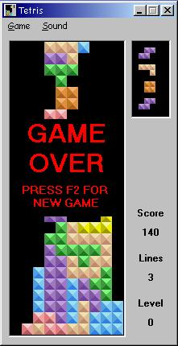



## \[ Tetris \]

### Description

** Update 9/30 faster levels and added 30 songs(835Kb but worth waiting)** This splendid Tetris game was originally submitted by Jeremiah Hughes about three years ago on PSC under the name 'Miah Tetris'. It still is one of the best Tetris versions I ever saw. I decided to improve the user interface a bit, integrated the soundeffects in a res files, done some changes to the levels and the preview blocks, made it possible to play more midi files (just add them into the games folder, they are found all over the internet) and I got out the little 'bug' (seen in many tetris clones) that prevents you from turning a block when falling along the side. Most important and not to be forgotten: The game code itselve is pretty much unchanged so THE FULL CREDITS FOR THIS GAME GOES TO Jeremiah Hughes !!! Special thanks to him for the great code. This code is worth getting reanimated so that every tetris fan can enjoy it again. I submit it specially at the end of the month so that I cannot benifit of all your votes, and that those votes are nothing less than credits to Jeremiah.
 
### More Info
 

             |
---                |---
**Submitted On**   |2004-09-29 15:41:00
**By**             |[D\. Rijmenants](https://github.com/Planet-Source-Code/PSCIndex/blob/master/ByAuthor/d-rijmenants.md)
**Level**          |Intermediate
**User Rating**    |4.7 (66 globes from 14 users)
**Compatibility**  |VB 5\.0, VB 6\.0
**Category**       |[Games](https://github.com/Planet-Source-Code/PSCIndex/blob/master/ByCategory/games__1-38.md)
**World**          |[Visual Basic](https://github.com/Planet-Source-Code/PSCIndex/blob/master/ByWorld/visual-basic.md)
**Archive File**   |[\[\_Tetris\_\]1799009302004\.zip](https://github.com/Planet-Source-Code/d-rijmenants-tetris__1-56415/archive/master.zip)

